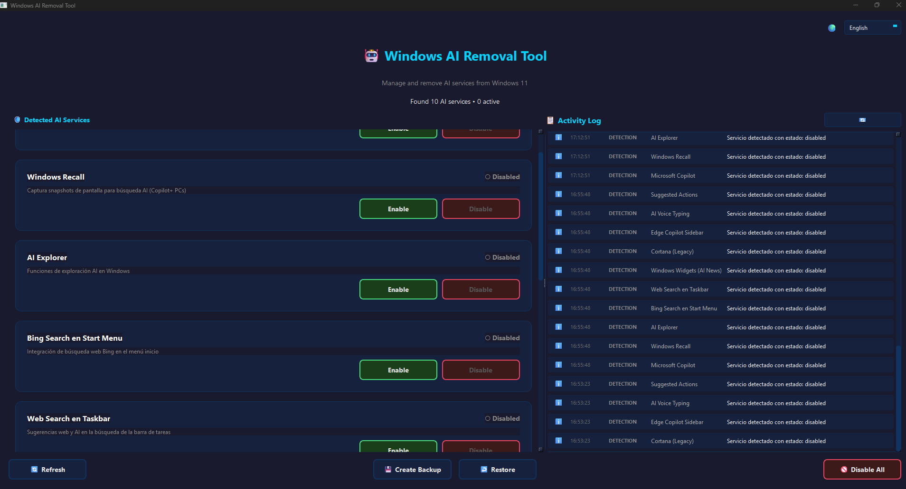
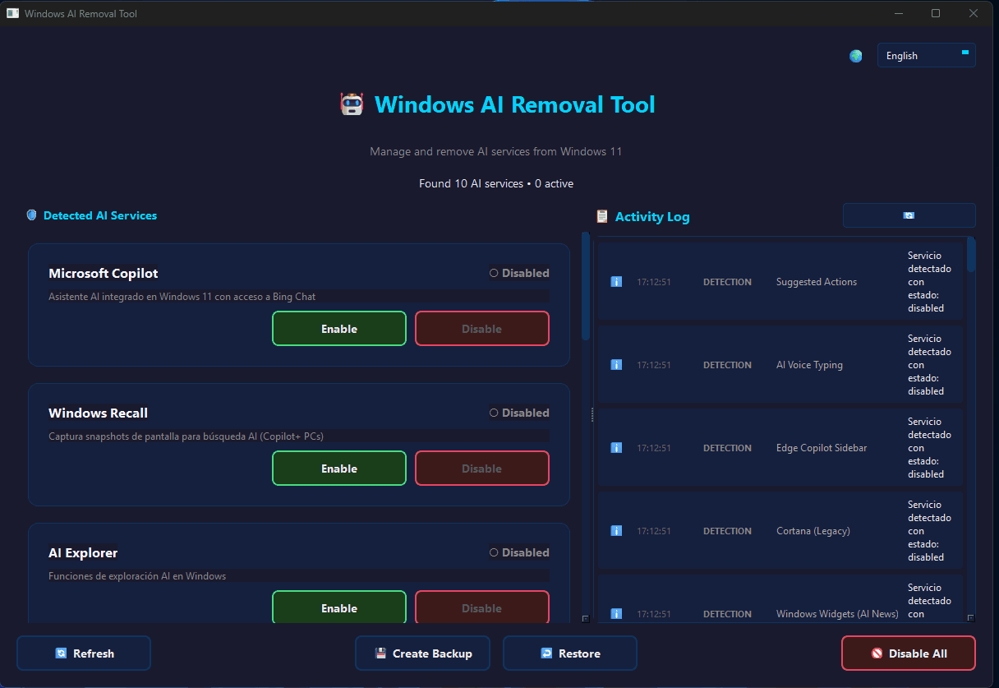

# Windows AI Removal Tool

<p align="center">
  
</p>

<p align="center">
  <a href="https://github.com/waar19/win-ai-tools/releases"></a>
  <a href="https://github.com/waar19/win-ai-tools/releases"></a>
  <a href="https://github.com/waar19/win-ai-tools/blob/main/LICENSE"></a>
  <a href="https://github.com/waar19/win-ai-tools/stargazers"></a>
</p>

<p align="center">
  <b>Take back control of your Windows 11 PC by disabling unwanted AI features</b>
</p>

---

## ✨ Features

- 🤖 **Detect AI Services** - Automatically scans for 11 different AI integrations
- ⚡ **Enable/Disable** - Toggle individual services on or off
- 🚫 **Disable All** - One-click to disable all AI services
- 💾 **Backup & Restore** - Create backups before making changes
- 📋 **Activity Log** - Track all changes with persistent logging
- 🌍 **Multi-language** - English, German, Spanish
- 🎨 **Modern UI** - Dark theme with intuitive interface

## 🎬 Demo

<p align="center">
  
</p>

## 🤖 Supported AI Services

| Service | Description |
|---------|-------------|
| Microsoft Copilot | Windows 11 AI assistant with Bing Chat |
| Windows Recall | AI-powered screenshot timeline (Copilot+ PCs) |
| AI Explorer | AI exploration features in Windows |
| Bing Search | Web search integration in Start Menu |
| Web Search | AI suggestions in taskbar search |
| Windows Widgets | AI-personalized news widgets |
| Cortana (Legacy) | Voice assistant |
| Edge Copilot | Copilot sidebar in Microsoft Edge |
| AI Voice Typing | Enhanced voice dictation |
| Suggested Actions | AI-suggested actions when copying text |

## 📥 Installation

### Option 1: Download Release (Recommended)

1. Go to [Releases](https://github.com/waar19/win-ai-tools/releases)
2. Download `WinAIRemovalTool.exe`
3. Run as Administrator

### Option 2: Run from Source

```bash
git clone https://github.com/waar19/win-ai-tools.git
cd win-ai-tools
pip install -r requirements.txt
python main.py
```

## 🔨 Building from Source

### Prerequisites

- Python 3.10+
- pip

### Build Steps

```bash
pip install -r requirements.txt
pip install pyinstaller pillow

pyinstaller --clean app.spec
```

The executable will be in `dist/WinAIRemovalTool.exe`

## 🛡️ How It Works

The application modifies Windows settings through:

1. **Registry Keys** - Modifies `HKEY_LOCAL_MACHINE` and `HKEY_CURRENT_USER` policies
2. **Appx Packages** - Removes Microsoft AI-related packages
3. **Windows Features** - Disables optional Windows features like Recall

All changes are reversible through the backup/restore functionality.

## ⚠️ Important Notes

- **Run as Administrator** - Required to modify system settings
- **Create Backup First** - Always backup before making changes
- **Windows Updates** - Some settings may reset after major Windows updates
- **SmartScreen Warning** - Windows may show a warning for unsigned executables

## 📁 Project Structure

```
win-ai-tools/
├── main.py              # Application entry point
├── requirements.txt     # Python dependencies
├── app.spec             # PyInstaller configuration
├── core/                # Core logic
│   ├── ai_services.py   # AI service definitions
│   ├── detector.py      # Service detection
│   ├── manager.py       # Enable/disable logic
│   ├── logger.py        # Activity logging
│   └── i18n.py          # Internationalization
└── ui/                  # User interface
    ├── main_window.py   # Main window
    ├── service_card.py  # Service card widget
    ├── log_viewer.py    # Activity log panel
    ├── language_selector.py  # Language dropdown
    └── styles.py        # Dark theme styles
```

## 🌍 Languages

- 🇺🇸 English
- 🇩🇪 Deutsch (German)
- 🇪🇸 Español (Spanish)

## 🤝 Contributing

Contributions are welcome! Please feel free to submit a Pull Request.

1. Fork the repository
2. Create your feature branch (`git checkout -b feature/amazing-feature`)
3. Commit your changes (`git commit -m 'Add amazing feature'`)
4. Push to the branch (`git push origin feature/amazing-feature`)
5. Open a Pull Request

## 📄 License

This project is open source and available under the [MIT License](LICENSE).

## ⭐ Support

If you find this tool useful, please consider:
- Giving it a ⭐ on GitHub
- Sharing it with others who might benefit
- [Reporting issues](https://github.com/waar19/win-ai-tools/issues) or suggesting features

---

<p align="center">
  Made with ❤️ for Windows users who value their privacy
</p>
